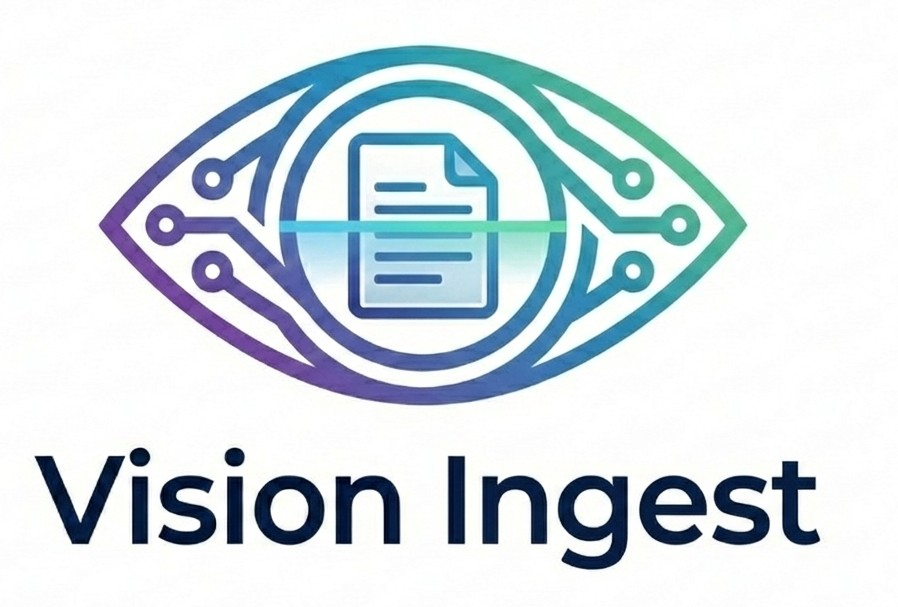
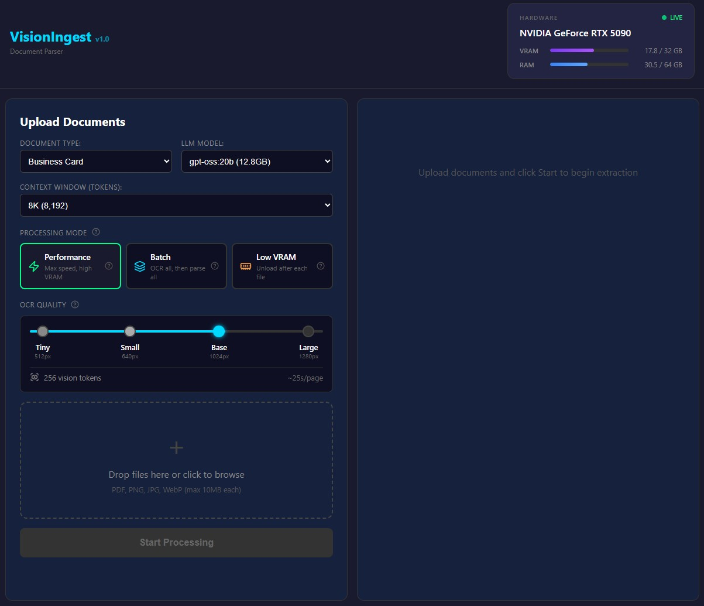
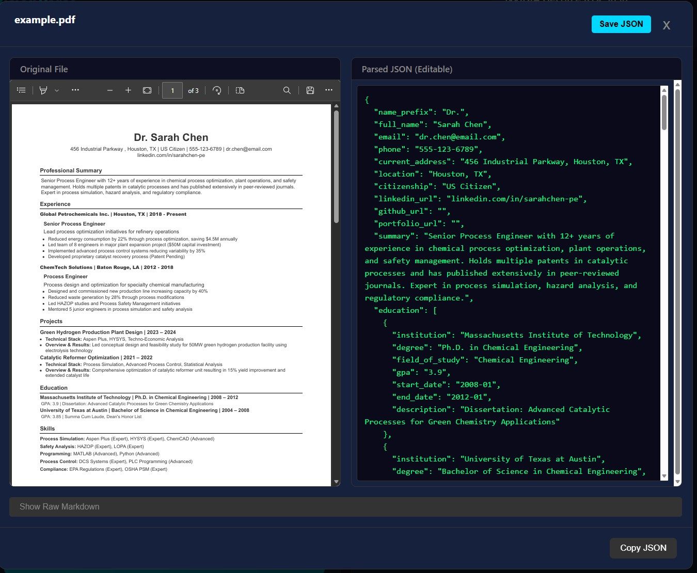

<p align="center">
  
</p>

<h1 align="center">VisionIngest</h1>

<p align="center">
  <strong>AI-Powered Document Parser | PDF to JSON | OCR + LLM Pipeline</strong>
</p>

<p align="center">
  Extract structured data from PDFs and images using DeepSeek-OCR-2 and local LLMs.
  <br/>
  100% local processing. No cloud APIs. Your data stays private.
</p>

<p align="center">
  
  
  
  
  
</p>

---

## What is VisionIngest?

VisionIngest is a **local-first document parsing application** that converts PDFs, scanned documents, and images into structured JSON data. It uses a two-stage AI pipeline:

1. **Vision Model (Eyes)**: DeepSeek-OCR-2 extracts text and layout as markdown
2. **Language Model (Brain)**: Local LLM (via Ollama) converts markdown to structured JSON

**No data leaves your machine.** Perfect for sensitive documents like resumes, contracts, invoices, and medical records.

---

## Screenshots

<p align="center">
  
  <br/>
  <em>Upload interface with document type selection, processing modes, and OCR quality control</em>
</p>

<p align="center">
  
  <br/>
  <em>Side-by-side view: Original document vs. Extracted JSON (editable)</em>
</p>

---

## Key Features

| Feature | Description |
|---------|-------------|
| **Multi-Document Support** | Resumes, invoices, receipts, contracts, business cards, and more |
| **100% Local Processing** | No cloud APIs - your data never leaves your machine |
| **GPU Accelerated** | CUDA support for fast processing on NVIDIA GPUs |
| **Flexible Processing Modes** | Performance, Batch, and Low VRAM modes for any hardware |
| **Adjustable OCR Quality** | 4 presets from fast (512px) to high-quality (1280px) |
| **Editable JSON Output** | Edit extracted data directly in the UI |
| **REST API** | Full API for integration with other applications |
| **Modern Web UI** | React-based interface with real-time GPU monitoring |

---

## Supported Document Types

- **HR & Recruiting**: Resumes, CVs, Cover Letters
- **Finance**: Invoices, Receipts, Bank Statements
- **Legal**: Contracts, NDAs, Agreements
- **Business**: Business Cards, Reports, Forms
- **Academic**: Transcripts, Certificates, Research Papers
- **Custom**: Add your own templates with JSON schema + prompt

---

## Technology Stack

| Component | Technology |
|-----------|------------|
| **Vision Model** | DeepSeek-OCR-2 (Visual Causal Flow architecture) |
| **Language Model** | Local LLM via Ollama (gpt-oss, llama3, mistral, etc.) |
| **Backend** | FastAPI (Python 3.11+) |
| **Frontend** | React 18 + TypeScript + Vite |
| **GPU** | CUDA 12.8 with Flash Attention 2 |
| **Package Manager** | uv (10x faster than pip) |

---

## Quick Start

### 1. Install Ollama (One-Time)

```bash
# Windows
winget install Ollama.Ollama

# Pull a model
ollama pull gpt-oss
```

### 2. Download the OCR Model (One-Time)

```bash
download_model.bat
```

### 3. Start the Application

```bash
start.bat
```

That's it! The browser opens automatically at `http://localhost:5173`

---

## Processing Modes

| Mode | Description | VRAM Usage |
|------|-------------|------------|
| **Performance** | Both models stay in VRAM. Fastest. | 16+ GB |
| **Batch** | OCR all files first, then parse all. Good for multiple files. | 12+ GB |
| **Low VRAM** | Unload OCR after each file. Slowest but works on 8GB. | 8 GB |

---

## OCR Quality Presets

| Preset | Resolution | Speed | Best For |
|--------|------------|-------|----------|
| **Tiny** | 512px | ~8s/page | Quick previews, simple docs |
| **Small** | 640px | ~12s/page | Standard documents |
| **Base** | 1024px | ~25s/page | Most documents (default) |
| **Large** | 1280px | ~40s/page | Dense text, fine print |

---

## Project Structure

```
VisionIngest/
├── backend/              # FastAPI application
│   ├── templates/        # Document templates (JSON schemas + prompts)
│   ├── ocr_adapter.py    # DeepSeek-OCR-2 adapter
│   ├── llm_parser.py     # LLM parser adapter
│   └── main.py           # API endpoints
├── frontend/             # React UI
│   └── src/
│       ├── components/   # UI components
│       └── App.tsx       # Main app
├── models/               # AI models (downloaded separately)
├── assets/               # Images for README
├── start.bat             # One-click startup script
└── requirements.txt      # Python dependencies
```

---

## License

**Business Source License 1.1**

- Non-commercial use only
- Converts to Apache 2.0 on 2029-01-01

See [LICENSE](LICENSE) for full terms.
